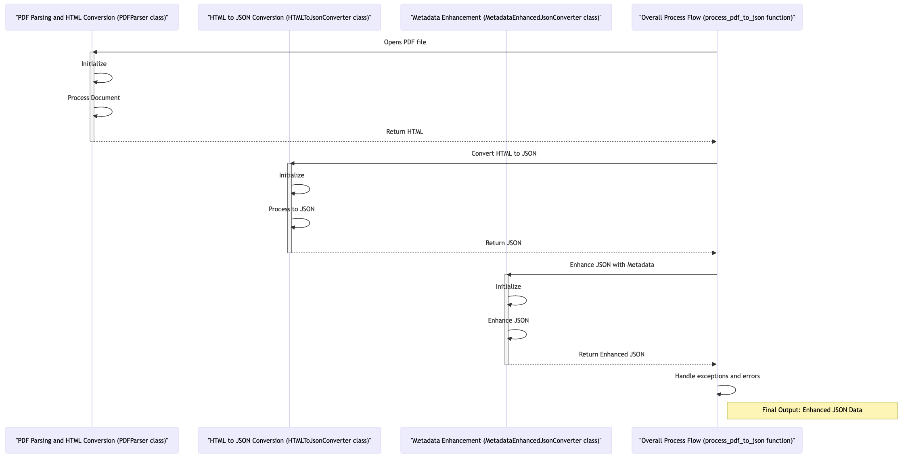

# PDF to JSON Converter

## Overview
The PDF to JSON Converter is a tool designed for converting PDF documents into structured JSON format. It uses Streamlit framework based frontend, and PyMuPDF for efficient processing and a user-friendly interface.

## Key Features
- **PDF File Uploading**: Easy upload of PDF files.
- **Base URL Input**: Customize the JSON output with a base URL.
- **Text Extraction**: Accurate extraction of text based on font styles.
- **HTML to JSON Conversion**: Intermediate conversion into HTML structure before JSON formatting.
- **Metadata Enhancement**: Enriches JSON output with additional metadata.

## How It Works

1. **Uploading PDF**: Users upload a PDF file through the Streamlit interface.
2. **Parsing PDF**: The `PDFParser` class processes the document, segregating text elements.
3. **HTML Conversion**: The parsed data is converted into an HTML-like structure.
4. **JSON Formatting**: The HTML-like data is transformed into structured JSON.
5. **Metadata Addition**: Additional metadata is added to the JSON output.
6. **Output Display**: Final JSON is displayed and available for use.

## Benefits
- **Structured Data**: Transforms complex PDF layouts into an easily manageable format.
- **Customizable Output**: Base URL inclusion provides context to the extracted data.
- **User-Friendly Interface**: Ensures ease of use.

## Installation and Usage
- Install by cloning the GitHub repository.
- Use Poetry for dependency management:
  - Run `poetry install` to install the dependencies.
  - Run `poetry run streamlit run app.py` to execute the application.
- Access the application through the provided Streamlit web link.
